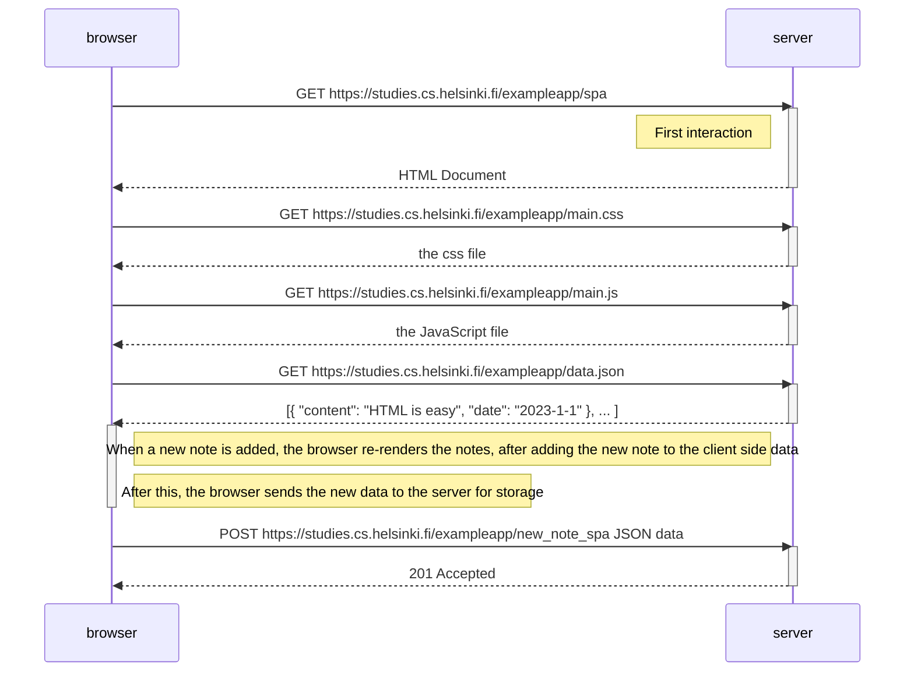

```mermaid
    sequenceDiagram
        participant browser
        participant server

        browser->>server: GET https://studies.cs.helsinki.fi/exampleapp/spa 
        activate server
        Note left of server: First interaction
        server-->>browser: HTML Document
        deactivate server

        browser->>server: GET https://studies.cs.helsinki.fi/exampleapp/main.css
        activate server
        server-->>browser: the css file
        deactivate server

        browser->>server: GET https://studies.cs.helsinki.fi/exampleapp/main.js
        activate server
        server-->>browser: the JavaScript file
        deactivate server

        browser->>server: GET https://studies.cs.helsinki.fi/exampleapp/data.json
        activate server
        server-->>browser: [{ "content": "HTML is easy", "date": "2023-1-1" }, ... ]
        deactivate server


        activate browser
        note right of browser: When a new note is added, the browser re-renders the notes, after adding the new note to the client side data
        note right of browser: After this, the browser sends the new data to the server for storage
        deactivate browser

        browser->>server: POST https://studies.cs.helsinki.fi/exampleapp/new_note_spa JSON data
        activate server
        server-->>browser: 201 Accepted
        deactivate server

    

```